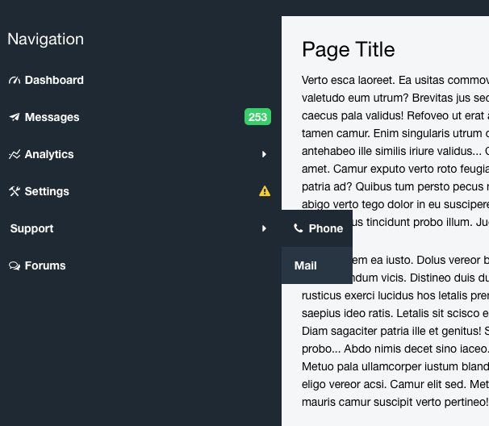

Agile Toolkit Menu Widget
==

This is a multi-level menu implementation for Agile Toolkit CSS.

Usage
--

Add the following line early in your API's init():

    $this->api->add('romaninsh/menu/Controller');

This will initialize the add-on with necessary path includes. Next, you define menu like this:

    $m=$this->add('romaninsh/menu/Vertical');
    $m->addTitle('Navigation');

    $m->addItem(['Dashboard', 'icon'=>'gauge-1']);

    $m->addItem(['Messages', 'icon'=>'paper-plane', 'label'=>[253, 'swatch'=>'green']]);

    $m_analytics=$m->addMenu(['Analytics', 'icon'=>'chart-line'],'Horizontal');
    $m_analytics->addItem('SubItem #1');
    $m_analytics->addItem('SubItem #2');

    $m->addItem(['Settings', 'icon'=>'tools', 'icon2'=>['attention', 'swatch'=>'yellow']]);
    
    $m->addSeparator();

    $m_support=$m->addMenu(['Support', 'icon'=>'lifebouy']);
    $m_support->addClass('span_3');
    $m_support->addItem(['Phone', 'icon'=>'phone'])
        ->js('click')->univ()->alert('calling your mom');
    $m_support->addItem(['Mail', 'icon'=>'email']);

    $m_support=$m->addItem(['Forums', 'icon'=>'chat-empty'])
        ;

If you wish to use this menu inside a sidebar of your layout after adding layout in API:

    $m=$this->layout->addMenu('romaninsh/menu/Vertical');

followed by menu initialization.

Example
--

Feature Description
--

### addTitle( label )
Creates a non-clickable label in your menu. You may have multiple.

### addSeparator( )
Creates horizontal separator. Can't be clicked or highlighted

### addItem ( label, action )
Creates a clickable item in the menu. 

### addMenu ( label, [class] )
Creates a recursive sub-menu. By default all sub-menus are Vertical unless you specify 'Horizontal' as a second argument. You may also specify your own class.

### label
Label defines the presentation of the item. For easiest use-case it can be a simple string.

You may also define label as array, in which case the following semantic is used:

    [ 'Text Label Here', 'prop'=>'value' ]

Where `prop` could be:

 - `'icon'=>'pencil'`: will add icon on the left
 - `'label'=>123`: will add badge on the right
 - `'icon2'=>'pencil'`: will add icon on the right
 
The `value` can also be defined as an array, in which case extra arguments are considered `icon components`, for example: `['pencil', 'size'=>'mega', 'swatch'=>'yellow']` will display a big yellow pencil as an icon.
 
For all other values of a `prop` those would be considered `menu item components` and will be applied on `<a>` element.

### action

This is default JS action of Agile Toolkit. It could be a JS chain or a PHP callback. For more information and arguments see documentation for second argument of `view->on()` in Agile Toolkit JavaScript binding documentation.